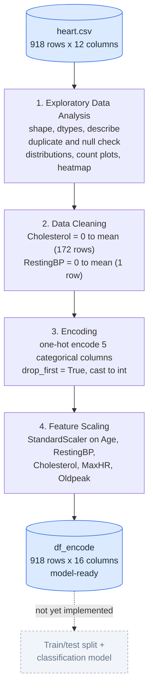
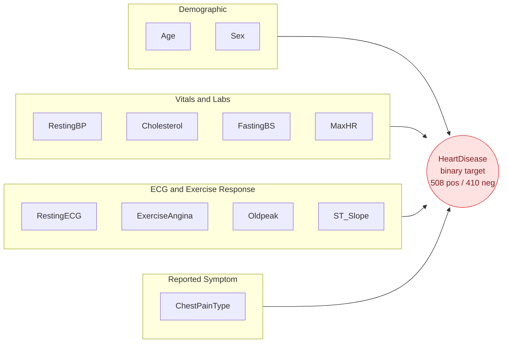

# 🫀 Heart Disease Risk Analysis

*Repository: `ml-heart-disease-prj2`*

Exploratory data analysis, data cleaning, encoding, and feature scaling on the **Heart Failure Prediction Dataset** — preparing clinical and demographic data for a future heart-disease classification model.


## Table of Contents
- [Overview](#overview)
- [Dataset](#dataset)
- [Repository Structure](#repository-structure)
- [Project Workflow](#project-workflow)
- [Feature Overview](#feature-overview)
- [Methodology](#methodology)
- [Key Findings](#key-findings)
- [Getting Started](#getting-started)
- [Tech Stack](#tech-stack)
- [Project Status & Roadmap](#project-status--roadmap)
- [Notes & Recommendations](#notes--recommendations)
- [License](#license)
- [Acknowledgments](#acknowledgments)

## Overview

This project explores the **Heart Failure Prediction Dataset** (918 patients) to understand which clinical and demographic factors are associated with the presence of heart disease. Everything lives in a single notebook, `Untitled.ipynb`, which walks through a complete data-preparation pipeline:

1. **Exploratory Data Analysis** — distributions, class balance, correlations
2. **Data cleaning** — fixing physiologically-invalid zero readings
3. **Encoding** — categorical → one-hot numeric columns
4. **Feature scaling** — standardizing the numeric columns

The result is a clean, model-ready DataFrame (`df_encode`) ready to be split and fed into a classifier.

|  |  |
|---|---|
| **Rows** | 918 (0 duplicates, 0 missing values) |
| **Predictors** | 11 raw → 15 after one-hot encoding |
| **Target** | `HeartDisease` — binary (508 positive / 410 negative, ~55%/45%) |
| **Task type** | Binary classification — data-prep phase; modeling not yet implemented |
| **Environment** | Python 3.11.9, Jupyter Notebook |

> **Note:** This notebook currently covers EDA through feature scaling only — no classification model has been trained yet. See [Project Status & Roadmap](#project-status--roadmap).

## Dataset

The data lives in [`heart.csv`](./heart.csv) — 918 rows × 12 columns, one row per patient. It's the widely used **Heart Failure Prediction Dataset**, which combines five classic clinical heart-disease datasets (Cleveland 303, Hungarian 294, Switzerland 123, Long Beach VA 200, and Statlog Heart 270 — 1,190 records total, minus 272 duplicates, leaving 918 unique patients), all originally sourced from the UCI Machine Learning Repository.

| Column | Type | Description | Range / Values |
|---|---|---|---|
| `Age` | int | Patient age (years) | 28 – 77 |
| `Sex` | category | Biological sex | `M` (725), `F` (193) |
| `ChestPainType` | category | Chest pain classification | `TA` (typical angina), `ATA` (atypical angina), `NAP` (non-anginal pain), `ASY` (asymptomatic) |
| `RestingBP` | int | Resting blood pressure (mm Hg) | 0 – 200 (raw; 0 is an invalid placeholder) |
| `Cholesterol` | int | Serum cholesterol (mg/dl) | 0 – 603 (raw; 0 is an invalid placeholder) |
| `FastingBS` | binary | Fasting blood sugar > 120 mg/dl | `1` = true (214), `0` = false (704) |
| `RestingECG` | category | Resting electrocardiogram results | `Normal` (552), `ST` (ST-T wave abnormality, 178), `LVH` (probable/definite left ventricular hypertrophy, 188) |
| `MaxHR` | int | Maximum heart rate achieved | 60 – 202 |
| `ExerciseAngina` | category | Exercise-induced angina | `Y` (371), `N` (547) |
| `Oldpeak` | float | ST depression induced by exercise, relative to rest | -2.6 – 6.2 |
| `ST_Slope` | category | Slope of the peak exercise ST segment | `Up` (395), `Flat` (460), `Down` (63) |
| `HeartDisease` | binary | Presence of heart disease — **target variable** | `1` = disease (508), `0` = no disease (410) |

No missing values or duplicate rows are present. However, `RestingBP` and `Cholesterol` use **`0` as a placeholder for missing readings** rather than `NaN` — 1 row for `RestingBP` and 172 rows (~19%) for `Cholesterol` — which the notebook corrects during cleaning (see [Methodology](#methodology)).

*Note: `Sex` is skewed toward male patients (~79%), a known characteristic inherited from the original clinical source datasets — worth keeping in mind for generalization.*

## Repository Structure

```
ml-heart-disease-prj2/
├── Untitled.ipynb    # Main analysis notebook: EDA → cleaning → encoding → scaling
├── heart.csv         # Raw dataset (918 records, 12 columns)
└── README.md         # Project documentation (this file)
```

## Project Workflow

The diagram below traces exactly what the notebook does to `heart.csv`, end to end. Diagrams are written in [Mermaid](https://mermaid.js.org/) and render automatically on GitHub/GitLab.



**Reading the diagram:** the two blue cylinders are the "before" and "after" datasets — raw `heart.csv` going in, and the cleaned, encoded, scaled `df_encode` coming out. Each rectangle in between is one notebook stage, annotated with the exact operation and how many rows it touched. The dashed box at the end is the natural next step (a trained model) that the notebook doesn't yet contain — it's shown for context, not because it exists in the code.

## Feature Overview

This second diagram groups the 11 predictors by what they measure, and shows how they all feed into the single target column.



**Reading the diagram:** the four boxes are the natural feature families in this dataset — basic demographics, routine vitals/labs, ECG and exercise-test results, and the patient's reported symptom type. All four groups flow into the red `HeartDisease` node, the binary outcome every feature is ultimately being used to explain.

## Methodology

*(the notebook itself groups these steps under two markdown headers, "EDA" and "Data Preprocessing and Cleaning" — the four stages below reorganize the same operations by what they do, for clarity)*

### 1. Exploratory Data Analysis
- Inspected shape, dtypes, and summary statistics (`.describe()`)
- Checked for duplicates (0 found) and missing values (0 found)
- Plotted the target class balance (`HeartDisease` bar chart)
- Histograms (with KDE) for `Age`, `RestingBP`, `Cholesterol`, `MaxHR`
- Ran an automated structural summary via the `sheryanalysis` package (shape, dtypes, null counts, categorical vs. numerical split)
- Count plots for `Sex`, `ChestPainType` × `HeartDisease`, `FastingBS` × `HeartDisease`
- Box plot of `Cholesterol` by `HeartDisease`; violin plot of `Age` by `HeartDisease`
- Correlation heatmap across all numeric columns

### 2. Data Cleaning
- Discovered that `Cholesterol` and `RestingBP` use `0` as an invalid placeholder for missing readings (found via `.value_counts()`)
- Replaced `Cholesterol == 0` with the mean of all non-zero readings (172 rows affected), rounded to 2 decimals
- Replaced `RestingBP == 0` with the mean of all non-zero readings (1 row affected), rounded to 2 decimals
- Re-plotted the four histograms after cleaning to confirm the fix

### 3. Encoding
- One-hot encoded all 5 categorical columns (`Sex`, `ChestPainType`, `RestingECG`, `ExerciseAngina`, `ST_Slope`) with `pd.get_dummies(drop_first=True)`, expanding 12 → 16 columns
- Cast every column to `int`

### 4. Feature Scaling
- Applied `StandardScaler` to the five continuous columns — `Age`, `RestingBP`, `Cholesterol`, `MaxHR`, `Oldpeak` — for zero mean and unit variance
- `FastingBS`, `HeartDisease`, and the one-hot dummy columns are left unscaled (already binary)

## Key Findings

**Correlation with `HeartDisease`** (computed after cleaning, matching the notebook's heatmap):

| Feature | Correlation |
|---|---|
| `Oldpeak` | **0.40** |
| `MaxHR` | **-0.40** |
| `Age` | 0.28 |
| `FastingBS` | 0.27 |
| `RestingBP` | 0.12 |
| `Cholesterol` | 0.09 |

**From the categorical and distribution plots:**
- **Chest pain type is the strongest categorical signal.** Asymptomatic patients (`ASY`) are positive for heart disease **79%** of the time (392 of 496), while atypical angina (`ATA`) patients are positive only **14%** of the time (24 of 173) — a counter-intuitive but clinically recognized pattern, since "silent"/asymptomatic presentation often accompanies more advanced disease.
- **Elevated fasting blood sugar tracks with higher risk:** patients with `FastingBS = 1` are positive **79%** of the time, versus **48%** for `FastingBS = 0`.
- **Older patients skew positive:** median age is **57** for patients with heart disease vs. **51** for those without, consistent with `Age`'s positive correlation.
- **Cholesterol is a weak, noisy signal even after cleaning** — median values are close between groups (244.6 vs. 235.0) with heavy overlap and outliers on both sides, matching its low 0.09 correlation.

## Getting Started

### Prerequisites
- Python 3.11+ (developed and tested on 3.11.9)
- Jupyter Notebook or JupyterLab

### Installation
```bash
# 1. Clone or download this repository, then move into it
git clone <repository-url>
cd ml-heart-disease-prj2

# 2. (Recommended) create a virtual environment
python -m venv venv
source venv/bin/activate      # Windows: venv\Scripts\activate

# 3. Install dependencies
pip install numpy pandas seaborn matplotlib scikit-learn jupyter sheryanalysis==0.1.0
```

### Usage
```bash
jupyter notebook Untitled.ipynb
```
Run all cells top to bottom. Keep `heart.csv` in the same folder as the notebook — it's loaded with a relative path (`pd.read_csv('heart.csv')`).

## Tech Stack

| Library | Purpose | Version tested in this notebook |
|---|---|---|
| pandas | Data loading & manipulation | 3.0.5 |
| numpy | Numerical operations | 1.26.4 |
| seaborn | Statistical visualization | — |
| matplotlib | Plotting | — |
| scikit-learn | `StandardScaler` | 1.9.0 |
| sheryanalysis | Automated quick-EDA summary report | 0.1.0 |

## Project Status & Roadmap

**Done:** EDA, class-balance and correlation analysis, cleaning of invalid zero readings, one-hot encoding, and feature scaling down to a model-ready DataFrame.

**Not yet done — no model has been trained.** Suggested next steps:
- [ ] Train/test split (stratified, given the ~55/45 class balance)
- [ ] Baseline classifier (Logistic Regression)
- [ ] Compare against tree-based models (Random Forest, Gradient Boosting) and/or SVM / KNN
- [ ] Evaluate with accuracy, precision, recall, F1-score, and ROC-AUC — not just accuracy, given the two classes aren't identical in size
- [ ] Confusion matrix and threshold analysis
- [ ] Cross-validation and hyperparameter tuning
- [ ] Persist `df_encode` to disk (e.g. `processed_heart.csv`) so modeling doesn't require re-running the whole notebook
- [ ] Add a `requirements.txt` / `environment.yml` for reproducible installs
- [ ] Rename `Untitled.ipynb` to something descriptive (e.g. `heart_disease_eda_and_preprocessing.ipynb`)

## Notes & Recommendations
- The `Cholesterol`/`RestingBP` zero-value imputation uses the **mean of the full dataset**. Once a train/test split exists, compute that mean from the training split only and apply it to test data, to avoid leakage.
- `Cholesterol` remains a weak, noisy predictor even after cleaning (correlation ≈ 0.09) — worth watching during feature selection, since it may contribute little beyond noise.
- The dataset's sex distribution is imbalanced (~79% male, inherited from the original clinical sources) — worth considering when assessing how well a trained model might generalize.
- `.ipynb_checkpoints/` is a Jupyter autosave folder — consider adding a `.gitignore` so it isn't committed to version control.

## License
No license file is currently included in this repository, so default copyright applies (all rights reserved). If you'd like others to reuse or build on this work, consider adding an open-source license such as [MIT](https://choosealicense.com/licenses/mit/).

## Acknowledgments
- Dataset: **Heart Failure Prediction Dataset**, combining the Cleveland, Hungarian, Switzerland, Long Beach VA, and Statlog Heart datasets, originally hosted at the [UCI Machine Learning Repository](https://archive.ics.uci.edu/ml/machine-learning-databases/heart-disease/) and distributed via [Kaggle](https://www.kaggle.com/datasets/fedesoriano/heart-failure-prediction).
